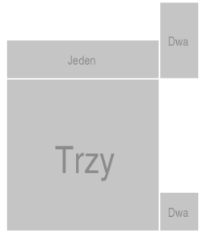
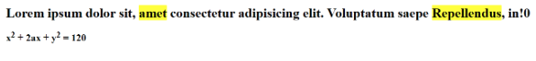

# 09_01_2023_Homework

## Zadanie 1: stworzenie menu z trzema podpunktami

Stwórz menu, które będzie składało się z trzech podpunktów: 

1. Recepcja
2. Gabinety lekarskie

    a) gabinet stomatologiczny

    b) gabinet dermatologiczny

    c) stomatologia

3. Laboratorium

--------------------------------------------------------

## Zadanie 2: stworzenie menu linkującego do innych plików

Stwórz menu, które będzie się składało z trzech linków, każdy link powinien kierować do oddzielnego pliku HTML.

Menu: (ten napis powinien być największym nagłówkiem)

- Sklep
- Kino
- Restauracja

Po kliknięciu w każdy z tych linków, powinniśmy zostać przekierowani do oddzielnych plików. Każdy ten plik powinien być prawidłowym dokumentem HTML. Powinien mieć duży nagłówek ze słowem z menu.

----------------------------------------------------------

## Zadanie 3: ułożenie obrazków

Stwórz dokument HTML, który będzie zawierał kilka zdjęć. Mają być ułożone tak:

------------------------

## Zadanie 4: wygląd treści w dokumencie

Stwórz dokument HTML, który będzie wyglądał tak:

